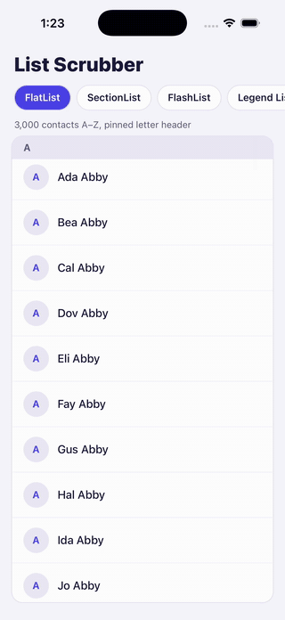

# react-native-list-scrubber

[](https://www.npmjs.com/package/react-native-list-scrubber)
[](https://github.com/philyoon/react-native-list-scrubber/actions/workflows/ci.yml)
[](LICENSE)

A draggable thumb for scrubbing through long React Native lists, with a label bubble beside the finger.



- **Runs on the UI thread.** The drag, the thumb, the list scroll _and the bubble label_ are all driven by
  Reanimated and Gesture Handler. They keep up with your finger even while JS is busy rendering rows.
- **Label bubble.** Pass labelled `sections` (A–Z, months, chapters…). The bubble shows the one under your
  finger, and it reaches the last section even when that section is shorter than a screen.
- **Pinned header.** `PinnedSectionHeader` shows the current section's name in a header pinned above the list.
  Unlike native sticky headers, it doesn't fall behind big jumps, and the next section's header pushes it out,
  like iOS Contacts.
- **Screen readers.** An adjustable "Scroll position" control is always present. Swipe up or down to step to
  the next section, and VoiceOver or TalkBack reads its label.
- **Large text.** Labels follow the system text size up to 1.5×, so they grow without overflowing the bubble
  or the pinned header.
- **Bring your own look.** You pass the text and haptics. Colours, sizes and timings have neutral defaults you
  can override one by one.
- **Works with** FlatList, SectionList, ScrollView, Legend List and FlashList. See
  [Compatibility](#compatibility).
- **Requires the New Architecture.** It's built on Reanimated 4, which runs only on React Native's New
  Architecture (the default since 0.76): React Native 0.78+, Reanimated 4.1+. Apps still on the old
  architecture with Reanimated 3 can't use it. See [Install](#install).

## Install

```sh
npm install react-native-list-scrubber
```

Peer dependencies (already in most Expo apps):

- React Native ≥ 0.78 with the New Architecture (the default since 0.76), and React ≥ 19
- `react-native-reanimated` ≥ 4.1 and `react-native-worklets` ≥ 0.5, in a pair Reanimated supports (see its
  [compatibility table](https://docs.swmansion.com/react-native-reanimated/docs/guides/compatibility/))
- `react-native-gesture-handler` ≥ 2.20, with `GestureHandlerRootView` at your app root

Keep exactly one copy of react-native-gesture-handler, matching your native runtime. Check with
`npm ls react-native-gesture-handler`. A second copy, pulled in by some other package's loose peer range,
crashes at startup.

## Usage

```tsx
import { useMemo } from 'react';
import { View } from 'react-native';
import Animated from 'react-native-reanimated';
import { ListScrubber, listLayout, useListScrubber } from 'react-native-list-scrubber';

const ROW = 64;

function Contacts({ contacts }: { contacts: Contact[] }) {
  // One section per first letter, and the matching getItemLayout
  const { sections, getItemLayout } = useMemo(
    () => listLayout(contacts, { label: (c) => c.name[0]!.toUpperCase(), itemHeight: ROW }),
    [contacts],
  );
  const scrubber = useListScrubber({ sections });

  return (
    <View style={{ flex: 1 }}>
      <Animated.FlatList
        {...scrubber.listProps}
        data={contacts}
        renderItem={renderContact}
        getItemLayout={getItemLayout}
      />
      <ListScrubber
        {...scrubber.scrubberProps}
        colors={{ thumb: '#7C7A96', thumbActive: '#4F46E5', bubble: '#1C1B3A', bubbleText: '#FFFFFF' }}
        accessibilityLabel="Scroll position"
      />
    </View>
  );
}
```

`listProps` holds `ref`, `onScroll`, `scrollEventThrottle`, `onLayout`, `onContentSizeChange` and hides the
native indicator. If your list needs its own handlers, pass them to the hook and they're called after the
scrubber's:

```tsx
const scrubber = useListScrubber({ onLayout, onContentSizeChange, onScroll: myScrollWorklet });
```

`onScroll` there is a worklet (it runs on the UI thread); keep its identity stable. The hook also returns the
pieces `listProps` and `scrubberProps` are made of (`listRef`, `scrollY`, `onScroll`, and the `contentHeight`
and `viewportHeight` shared values) for wiring them by hand; all of these are public API.

Measuring the list doesn't re-render your component: the heights are shared values, and only `ListScrubber`
re-renders when they change. This matters for lists whose content size changes often while scrolling
(FlashList, Legend List, infinite lists).

The list must be an **Animated** component, so the scroll handler runs on the UI thread:

| List                  | Use                                                    |
| --------------------- | ------------------------------------------------------ |
| FlatList / ScrollView | `Animated.FlatList`, `Animated.ScrollView`             |
| SectionList           | `Animated.createAnimatedComponent(SectionList)`        |
| Legend List           | `AnimatedLegendList` from `@legendapp/list/reanimated` |
| FlashList             | `Animated.createAnimatedComponent(FlashList)`          |

### Computing sections

Each section's `offset` is where it starts in the list's content, in points. When you know the rows' heights,
two helpers compute the sections and the list's `getItemLayout` from the same numbers, so they can't disagree:

- `listLayout(items, { label, itemHeight, listHeaderHeight? })` for flat lists (FlatList, FlashList, Legend
  List, or a ScrollView of fixed blocks). A new section starts wherever `label(item, index)` changes from one
  row to the next.
- `sectionListLayout(sections, { itemHeight, sectionHeaderHeight?, sectionFooterHeight?, listHeaderHeight?, label? })`
  for SectionList: one scrubber section per list section, labelled with its `title` by default. Its
  `getItemLayout` follows SectionList's indexing (a header, the rows and a footer per section).

```tsx
const { sections, getItemLayout } = useMemo(
  () => sectionListLayout(data, { itemHeight: ROW, sectionHeaderHeight: HEADER }),
  [data],
);
```

`itemHeight` is one number for every row, or a function for each row's own height. Include any item separator
in it. The first section starts at 0, so it also covers a list header above it. Lists that measure rows
themselves (FlashList, Legend List) ignore `getItemLayout`; use just `sections`. For rows of unknown height,
build `{ offset, label }[]` yourself.

### Pinned header

Put section headers in the list (with section `offset`s pointing at them), and pin a copy on top, next to the
list:

```tsx
<PinnedSectionHeader
  {...scrubber.headerProps}
  height={HEADER_HEIGHT}
  style={styles.header}
  textStyle={styles.headerText}
/>
```

`headerProps` carries `scrollY` and the `sections` given to `useListScrubber`, so the header and the scrubber
always read the same sections. (Both components also take `scrollY` and `sections` directly, for wiring by
hand.)

- It shows the current section's label, drawn on the UI thread: it changes in the same frame as the list, even
  during scrubber jumps. It's one native text field whose text is set on the UI thread, so its cost doesn't
  grow with the number of sections.
- As the next section's header reaches it, it's pushed up and out, like iOS Contacts. If the list has no
  section headers of its own, pass `push={false}`.
- Give the scrubber `insets={{ top: HEADER_HEIGHT }}` to keep the thumb out from under it.
- `testID` names the header (default `list-scrubber-pinned-header`) and its label (`<testID>-label`).
- The label follows the system text size up to `maxFontSizeMultiplier` (default 1.5), since the header's
  height is fixed. Raise it if your header is tall enough for larger text.
- For a custom pinned header, build it from `CurrentSectionLabel` (the label alone; its line height comes from
  the style's `lineHeight` or 1.3 × `fontSize`, scaled with the system text size, or from `height` as is) and
  `usePinnedSectionHeaderStyle(scrollY, sections, height)` (the push, as an animated style).
- With SectionList, turn off `stickySectionHeadersEnabled`: its native sticky headers only pin headers that
  are already rendered, so they lag behind scrubber jumps.

### Scrolling from code

The hook also moves the list, for a tappable A–Z index or a "jump to today" button:

```tsx
scrubber.scrollToSection(index); // the start of sections[index] (the hook's sections)
scrubber.scrollToOffset(y, { animated: true }); // a content offset, clamped to the list
```

Both scroll on the UI thread without animating by default: a long animated scroll shows blank rows until it
settles. The screen-reader value follows on its own. To jump by label, find the index first, e.g.
`sections.findIndex((s) => s.label === 'M')`.

### Labels that aren't sections

`labelAt(position, scrollOffset)` computes any label on the JS thread, for example "42%". It can lag a frame
or two behind a fast drag, so prefer `sections` when the labels are known ahead of time. `position` is the
content offset to describe: it slides from the top of the viewport at the start to its bottom at the end, so
the last rows get a label even when they're shorter than a screen. `scrollOffset` is the raw scroll position.
`sectionIndexAt(starts, y)` does a binary search over ascending section starts, if your labels come from a
list of your own.

## Props

Required:

- `scrollY`, `listRef`, `contentHeight`, `viewportHeight`: from `scrubberProps`. When wiring by hand, the
  heights can be plain numbers or shared values.
- `accessibilityLabel`: the screen-reader name. Required so it's always in your app's language.

Optional:

- `colors`: any of `thumb`, `thumbActive`, `bubble`, `bubbleText`. Defaults below.
- `sections`: `{ offset, label }[]` (see [Computing sections](#computing-sections)). `offset` is where the
  section starts in the list's content, in points (its header's top, or its first row's), ascending
  (development builds warn if they aren't, or if an offset isn't a finite number or a label is empty). Drives
  the bubble and the screen-reader steps.
- `labelAt(position, scrollOffset)`: a JS-thread label when there are no `sections`. The types accept one or
  the other.
- `accessibilitySteps`: screen-reader step targets. Default: the section offsets, else one screen. Dragging
  doesn't snap to them.
- `formatAccessibilityPercent`: the screen-reader value when there's no label. Default: `40%`.
- `onDragStart`, `onDragEnd`: the drag started or ended, e.g. for haptics.
- `onSectionChange(index, section)`: with `sections`, the finger crossed into another section while dragging,
  e.g. for a haptic tick. `section` has your sections' own type, so extra fields (`{ offset, label, id }`) are
  typed too.
- `side`: `'left'` or `'right'` edge of the list, as laid out left to right. Default: `'right'`. See
  [Right-to-left layouts](#right-to-left-layouts).
- `edgeOffset`: distance from that edge, negative to sit in a margin outside the list. Default: `0`.
- `insets`: `{ top, bottom }` space the thumb stays out of, e.g. under a pinned header or above a toolbar.
- `enabled`: `false` hides the scrubber and its screen-reader control, keeping its state. Default: `true`.
- `testID`: prefix of the test IDs (`<testID>` for the drag gesture, `-thumb`, `-a11y`, `-label`). Default:
  `list-scrubber`.
- `metrics`, `timing`: partial overrides of the defaults below.
- `bubbleStyle`, `bubbleTextStyle`: extra styles, e.g. a shadow or a font.

### Types

Every component's props and the hook's options and result are exported: `ListScrubberProps`,
`PinnedSectionHeaderProps`, `CurrentSectionLabelProps`, `UseListScrubberOptions`, `UseListScrubberResult`,
plus `ListScrubberSection`, `ListScrubberColors`, `ListScrubberMetrics` and `ListScrubberTiming`. For a
component that takes the hook's result with sections:
`UseListScrubberResult<any, readonly ListScrubberSection[]>`.

### Defaults (`LIST_SCRUBBER_DEFAULTS`)

| `colors`      |           |                                                 |
| ------------- | --------- | ----------------------------------------------- |
| `thumb`       | `#8E8E93` | Grey, at least 3:1 against both white and black |
| `thumbActive` | `#007AFF` | Blue while dragging                             |
| `bubble`      | `#3A3A3C` | Dark grey, with white `bubbleText` (`#FFFFFF`)  |
| `bubbleText`  | `#FFFFFF` |                                                 |

| `metrics`                               | pt      |                                                           |
| --------------------------------------- | ------- | --------------------------------------------------------- |
| `thumbLength`                           | 48      | Longer than a fingertip                                   |
| `thumbWidth` / `thumbActiveWidth`       | 6 / 8   | Thin when idle, thicker while grabbed                     |
| `thumbRadius`                           | 4       |                                                           |
| `bubbleSize`                            | 64      | Height and minimum width                                  |
| `bubbleGap`                             | 40      | Keeps the bubble clear of the finger                      |
| `bubbleRadius` / `bubblePadding`        | 16 / 16 |                                                           |
| `bubbleFontSize` / `bubbleLongFontSize` | 24 / 16 | Up to `bubbleShortLabelMaxLength` (2) characters / longer |

| `timing`      | ms   |                                          |
| ------------- | ---- | ---------------------------------------- |
| `hideAfterMs` | 1500 | Delay before hiding once scrolling stops |
| `fadeMs`      | 150  | Fade in and out                          |

The touch width is fixed at 44 pt, the minimum touch target.

## Right-to-left layouts

The scrubber places everything with `left` and `right`, never with flex alignment, so it mirrors as one piece:

- **iOS and Android:** React Native swaps `left` and `right` in RTL layouts by default, so in an RTL app the
  thumb moves to the left edge with the bubble on its right, without any change. Don't flip `side` for RTL:
  that would mirror it twice, back to the right. (Only if your app turned this off with
  `I18nManager.swapLeftAndRightInRTL(false)`, pick the side yourself.) Checked in the example app with
  `I18nManager.forceRTL(true)` on an iOS simulator (iPhone 17 Pro Max) and an Android emulator (Pixel 8): the
  thumb is at the left edge, and while dragging the bubble is on its right with the full label.
- **Web:** React Native Web keeps `left` and `right` as written, so on an RTL page pass `side="left"`
  yourself. Checked on Expo web in an RTL layout, with the bubble beside the thumb on either side.

## Compatibility

Tested in the example app (Expo SDK 57, React Native 0.86, Reanimated 4.5, Gesture Handler 2.32): by hand on
iOS, and with the [end-to-end tests](#end-to-end-tests) on iOS and Android, which drag the thumb to both ends
of FlatList, SectionList, FlashList, Legend List and ScrollView. The pinned header, push and section bubble
were also checked by hand on Android, in the app this library came from:

- **FlatList + `getItemLayout`**: exact. Bubble, pinned header and rows agree in every frame.
- **ScrollView**: exact.
- **Legend List + `getFixedItemSize`**: exact.
- **SectionList + `getItemLayout`**: exact. Use the pinned header above instead of native sticky headers,
  which lag behind big jumps.
- **FlashList v2**: works, but positions are estimates. FlashList sizes unmeasured rows at 200 pt and has no
  prop for real sizes, so on unvisited parts of a long list the thumb and labels can be off.

The scrubber needs to know where things are. Lists that measure rows as they render, such as FlatList without
`getItemLayout` or variable-height rows, give estimated positions.

During very fast drags a list can show blank rows for a moment while JS renders them. The scrubber itself
never waits for that. For FlatList, a small `windowSize` with a large `maxToRenderPerBatch` fills the screen
fastest after a jump.

## Testing your app

Rendering the real scrubber in Jest needs Reanimated, Worklets and Gesture Handler mocked. With Reanimated 4.6
or later, also set Jest's `resolver` to `react-native-reanimated/jest/resolver`; without it, loading
Reanimated's mock throws an error about `setCSSEventHandler`. To skip all of that, mock the package itself in
your Jest setup:

```js
jest.mock('react-native-list-scrubber', () => require('react-native-list-scrubber/jest'));
```

The mock loads none of those libraries and has every export, with the same types:

- `ListScrubber` renders only its screen-reader control: role `adjustable`, your `accessibilityLabel`, the
  first section's label (or "0%") as its value, and test ID `<testID>-a11y`.
- `PinnedSectionHeader` and `CurrentSectionLabel` show the first section's label, with the real test IDs.
- `useListScrubber` returns the same shape. Its shared values are plain objects with `get`/`set`. The list
  handlers record sizes and call your own, and `scrollToSection` / `scrollToOffset` set `scrollY` to where the
  real hook would scroll.
- `listLayout`, `sectionListLayout`, `sectionIndexAt` and `LIST_SCRUBBER_DEFAULTS` are the real ones.

The package ships ES modules. If Jest reports `Cannot use import statement outside a module`, add
`react-native-list-scrubber` to the packages your `transformIgnorePatterns` lets Babel transform.

## Troubleshooting

**The thumb never appears.** It shows while the list scrolls and hides a moment after, so scroll first. If it
still doesn't show:

- The list isn't an Animated component (`Animated.FlatList`, `Animated.createAnimatedComponent(…)`; see
  [Usage](#usage)), so the scroll handler never runs.
- A prop after `{...scrubber.listProps}` replaces one of its own. Pass `onScroll`, `onLayout` and
  `onContentSizeChange` to `useListScrubber` instead, and use `scrubber.listRef` rather than your own `ref`.
  Development builds warn when the list's `onLayout` or `onContentSizeChange` from `listProps` never ran a few
  seconds after it mounted.
- The content isn't taller than the list: there's nothing to scrub, so nothing is drawn.
- `enabled` is `false`, or the list and the scrubber aren't in the same container (the scrubber is positioned
  over its parent).

**Dragging the thumb does nothing.** The app root needs `GestureHandlerRootView`. If the list doesn't move but
the thumb does, the list's `ref` was replaced (see above).

**The bubble or the pinned header shows the wrong section.** The `offset`s don't match where the sections
really are. Item separators must be counted in the row heights, and offsets include the list header. Build
them with [`listLayout` / `sectionListLayout`](#computing-sections) when the heights are known; development
builds warn when offsets aren't ascending or finite. With SectionList, turn off `stickySectionHeadersEnabled`.

**"`sections` is a new array with the same contents…"** `sections` is rebuilt on every render, e.g.
`useListScrubber({ sections: items.map(…) })`. Wrap it in `useMemo`. It works without, but the sections are
checked and copied to the UI thread again on every render.

**The app crashes at startup with a Gesture Handler error.** There are two copies of
`react-native-gesture-handler`; see [Install](#install).

## Limits

- **Vertical lists only.** Horizontal lists aren't supported.
- **Right-to-left:** mirrored automatically on iOS and Android, not on web. See
  [Right-to-left layouts](#right-to-left-layouts).
- **Inverted lists** aren't handled: the thumb follows the content offset, not the visual direction.
- **Web: works, with limits.** Checked in the example app on Expo web (React Native Web 0.21) in desktop
  Chromium: the thumb appears on scroll, dragging scrolls every list type, and the bubble, pinned header and
  screen-reader value follow. The screen-reader control is a Tab stop there: ↓/→ and ↑/← step like a screen
  reader, Page Down/Up move one screen, Home/End go to the ends. With no separate UI thread on web, everything
  runs on JS. Not tested on mobile browsers.
- The section bubble is as wide as the widest section label: each label is laid out once, invisibly, then
  unmounted. That happens once the app is idle (or when the thumb shows, if that's sooner), not while the list
  first renders. New labels are measured on their own, so a list that grows a page at a time measures only the
  new page; the bubble only widens, never narrows, until its text style or the system text size changes.

## Example app

```sh
cd example
npm install
npx expo start
```

It opens in Expo Go and has one screen per list type, plus an Index screen: a tappable A–Z bar above a
SectionList that jumps with `scrollToSection`. It uses the library source from `../src`. `npm run web` opens
it in the browser instead (Expo web); CI builds that web bundle on every push.

### End-to-end tests

[Maestro](https://maestro.dev) flows in `example/e2e` drive the example in Expo Go on an iOS simulator or an
Android emulator: dragging the thumb to the end and back on each list type, stopping part way in the right
section, touches passing through the hidden thumb, the screen-reader control, and jumping from the A–Z index;
and the same drags in a right-to-left layout, in landscape, and at the largest system text size. They run on
iPhone SE, iPhone 17 Pro, iPhone 17 Pro Max and a Pixel 8 emulator.

From the repo root, with Expo Go installed on the simulator or emulator, start Metro in e2e mode and keep it
running:

```sh
npm run e2e:start
```

Then, in another terminal:

```sh
npm run e2e:ios                          # iOS simulator
npm run e2e:android                      # Android emulator (sets up adb reverse for Metro itself)
npm run e2e:ios -- e2e/index.yaml        # just some flows (paths relative to example/)
```

The right-to-left flows in `example/e2e/rtl` need Metro in RTL mode instead, which forces a right-to-left
layout from the app's first line of code. Restart Metro with it, run them, then go back to `npm run e2e:start`
(the next run switches Expo Go back to left-to-right):

```sh
npm run e2e:start:rtl                    # instead of e2e:start, then in another terminal:
npm run e2e:ios -- e2e/rtl
```

With more than one simulator or emulator running, pick one with `MAESTRO_DEVICE`, a simulator UDID or an
emulator serial: `MAESTRO_DEVICE=emulator-5554 npm run e2e:android`. The scripts (`example/scripts/e2e.sh`)
need a POSIX shell (macOS, Linux, WSL).

How the flows find the thumb: it is hidden from screen readers, so Maestro, which finds elements through the
accessibility tree, can't target it, and Maestro's swipe points are fixed screen percentages. In e2e mode
(`EXPO_PUBLIC_E2E=1`) the example pins its list to fixed percentages of the screen (`example/src/e2e.ts`), so
the same points land on the thumb on any phone size, in portrait or landscape: x 91%, or 9% in right-to-left
layouts. It also keeps the thumb up for 5 s instead of 1.5 s, since Maestro's wait after each swipe can
outlast the default on a slow device. A link like `exp://127.0.0.1:8081/--/?demo=ScrollView` opens a given
demo. The scripts first run `example/e2e/setup/expo-go.yaml`, which gets Expo Go past the screens it can show
on a fresh device, so each flow only waits for the app. The flows in `example/e2e/large-text` run at the
largest text size, which the scripts set on the device first and restore afterwards.

## Contributing

See [CONTRIBUTING.md](CONTRIBUTING.md) for setup, the checks CI runs, the example app and end-to-end tests.

## License

MIT
