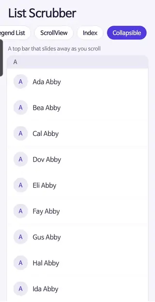

# react-native-list-scrubber

[](https://www.npmjs.com/package/react-native-list-scrubber)
[](https://github.com/philyoon/react-native-list-scrubber/actions/workflows/ci.yml)
[](LICENSE)

Fast scrolling for React Native lists. Drag a scrollbar thumb to jump through thousands of rows, with section
labels beside your finger.



- **Keeps up with your finger.** Built on Reanimated 4 and Gesture Handler: the drag, the list scroll _and the
  bubble label_ run on the UI thread, even while JS is busy rendering rows.
- **Section labels and a pinned header.** Give the hook your list's layout, from `listLayout` and your rows'
  heights, and the bubble shows the section under your finger (A–Z, months, chapters…). The layout gives the
  list its `getItemLayout` from the same heights, so the two can't disagree. `PinnedSectionHeader` keeps the
  current section pinned above the list, and the next one pushes it out, like iOS Contacts.
- **A top bar that slides away.** One option, `topBar`, gives the list a title or search bar that hides as you
  scroll down and comes back on a scroll up. The scrubber, the pinned header and the bar move as one: the bar
  stays put while you drag the thumb, and the drag never uncovers the space it leaves. See
  [A top bar that slides away](#a-top-bar-that-slides-away).
- **Accessible by default.** An adjustable "Scroll position" control is always present: VoiceOver and TalkBack
  users swipe up or down to step from section to section and hear its label. Labels follow the system text
  size up to 1.5×.
- **Works with** FlatList, SectionList, ScrollView, Legend List and FlashList. See
  [Compatibility](#compatibility).
- **Requires the New Architecture.** It's built on Reanimated 4, which runs only on React Native's New
  Architecture (the default since 0.76): React Native 0.78+, Reanimated 4.1+. Apps still on the old
  architecture with Reanimated 3 can't use it. See [Install](#install).

## Install

```sh
npm install react-native-list-scrubber
```

Peer dependencies (already in most Expo apps):

- React Native ≥ 0.78 with the New Architecture (the default since 0.76), and React ≥ 19
- `react-native-reanimated` ≥ 4.1 and `react-native-worklets` ≥ 0.5, in a pair Reanimated supports (see its
  [compatibility table](https://docs.swmansion.com/react-native-reanimated/docs/guides/compatibility/))
- `react-native-gesture-handler` ≥ 2.20, with `GestureHandlerRootView` at your app root

Keep exactly one copy of react-native-gesture-handler, matching your native runtime. Check with
`npm ls react-native-gesture-handler`. A second copy, pulled in by some other package's loose peer range,
crashes at startup.

## Usage

Each step adds one thing to the last: a thumb, then section labels, then a pinned header, then a top bar.

### A thumb

```tsx
import { View } from 'react-native';
import Animated from 'react-native-reanimated';
import { ListScrubber, useListScrubber } from 'react-native-list-scrubber';

function Contacts({ contacts }: { contacts: Contact[] }) {
  const scrubber = useListScrubber();
  return (
    <View style={{ flex: 1 }}>
      <Animated.FlatList {...scrubber.flatListProps} data={contacts} renderItem={renderContact} />
      <ListScrubber {...scrubber.scrubberProps} accessibilityLabel="Scroll position" />
    </View>
  );
}
```

The bubble and screen readers show where you are as a percentage ("40%"). The list must be an **Animated**
component, so the scroll handler runs on the UI thread. Spread the props named after your list: each holds
only props that list documents.

| List        | Use                                                    | Spread             |
| ----------- | ------------------------------------------------------ | ------------------ |
| FlatList    | `Animated.FlatList`                                    | `flatListProps`    |
| SectionList | `Animated.createAnimatedComponent(SectionList)`        | `sectionListProps` |
| FlashList   | `Animated.createAnimatedComponent(FlashList)`          | `flashListProps`   |
| Legend List | `AnimatedLegendList` from `@legendapp/list/reanimated` | `legendListProps`  |
| ScrollView  | `Animated.ScrollView`                                  | `scrollViewProps`  |

They all carry `listProps`: `ref`, `onScroll`, `scrollEventThrottle`, `onLayout`, `onContentSizeChange`, and
the native indicator hidden. Spread `listProps` itself on any other scrollable component. If your list needs
its own handlers, pass them to the hook and they're called after the scrubber's:

```tsx
const scrubber = useListScrubber({ onLayout, onContentSizeChange, onScroll: myScrollWorklet });
```

`onScroll` there is a worklet (it runs on the UI thread); keep its identity stable (development builds warn
when it's a new function on every render).

Colours, sizes and timings have neutral defaults; override any of them (see [Props](#props)). You pass the
text and haptics.

```tsx
<ListScrubber
  {...scrubber.scrubberProps}
  colors={{ thumb: '#7C7A96', thumbActive: '#4F46E5', bubble: '#1C1B3A', bubbleText: '#FFFFFF' }}
  accessibilityLabel="Scroll position"
/>
```

Measuring the list doesn't re-render your component: the heights are shared values, and only `ListScrubber`
re-renders when they change. This matters for lists whose content size changes often while scrolling
(FlashList, Legend List, infinite lists).

### Section labels

Give the hook the list's layout: where each section starts, from the rows' heights.

```tsx
const layout = useMemo(
  () => listLayout(contacts, { sectionLabel: (c) => c.name[0]!.toUpperCase(), itemHeight: ROW }),
  [contacts],
);
const scrubber = useListScrubber({ layout });

<Animated.FlatList {...scrubber.flatListProps} data={contacts} renderItem={renderContact} />
<ListScrubber {...scrubber.scrubberProps} accessibilityLabel="Scroll position" />
```

The bubble shows the section under your finger, and screen readers step from section to section.
`flatListProps` carry the layout's `getItemLayout`, so the list and the scrubber can't disagree. For a
SectionList, only the layout function and the spread change:

```tsx
const layout = useMemo(
  () => sectionListLayout(data, { itemHeight: ROW, sectionHeaderHeight: HEADER }),
  [data],
);
const scrubber = useListScrubber({ layout });

<AnimatedSectionList {...scrubber.sectionListProps} sections={data} renderItem={…} renderSectionHeader={…} />
```

- `listLayout(items, { sectionLabel, itemHeight, listHeaderHeight? })` is for flat lists (FlatList, FlashList,
  Legend List, or a ScrollView of fixed blocks). A new section starts wherever `sectionLabel(item, index)`
  changes from one row to the next.
- `sectionListLayout(sections, { itemHeight, sectionHeaderHeight?, sectionFooterHeight?, listHeaderHeight?, sectionLabel? })`
  is for SectionList: one scrubber section per list section, labelled with its `title` by default. Its
  `getItemLayout` follows SectionList's indexing (a header, the rows and a footer per section).
- `itemHeight` is one number for every row, or a function for each row's own height. Include any item
  separator in it. `listHeaderHeight` is the height of your own list header, if any.
- Wrap the layout in `useMemo`: it walks every row. Rebuilt on every render it still works, but development
  builds warn.
- FlashList and Legend List measure rows themselves: their spreads leave `getItemLayout` out. For rows whose
  heights you don't know ahead of time, build the sections yourself (see
  [Wiring it yourself](#wiring-it-yourself)).

### Pinned header

The current section's label, pinned over the top of the list. Give its height to the hook, and draw it next to
the list:

```tsx
const scrubber = useListScrubber({ layout, pinnedHeader: { height: HEADER } });

<Animated.FlatList {...scrubber.flatListProps} … />
<PinnedSectionHeader {...scrubber.pinnedHeaderProps} style={styles.header} textStyle={styles.headerText} />
<ListScrubber {...scrubber.scrubberProps} accessibilityLabel="Scroll position" />
```

- Over a SectionList it sits on the list's own section headers, and as the next one reaches it, it's pushed up
  and out, like iOS Contacts. Turn off the list's `stickySectionHeadersEnabled`: native sticky headers only
  pin headers that are already rendered, so they lag behind scrubber jumps.
- Over a flat list, which has no section headers of its own, it takes its own space at the top: the list's
  spread draws it, the scrubber stays below it, and it names the rows just below it.
- It changes in the same frame as the list, even during scrubber jumps: it's one native text field whose text
  is set on the UI thread, so its cost doesn't grow with the number of sections.
- `testID` names the header (default `list-scrubber-pinned-header`) and its label (`<testID>-label`).
- The label follows the system text size up to `maxFontSizeMultiplier` (default 1.5), since the header's
  height is fixed. Raise it if your header is tall enough for larger text.
- For a custom pinned header, build it from `CurrentSectionLabel` (the label alone; its line height comes from
  the style's `lineHeight` or 1.3 × `fontSize`, scaled with the system text size, or from `height` as is) and
  `usePinnedSectionHeaderStyle(scrollY, sections, height)` (the push, as an animated style).

### A top bar that slides away

A bar over the top of the list (a title, a search field…) can slide away as the list scrolls down and come
back on a scroll up, like Android's collapsing app bars. Give its height to the hook, and draw it inside a
view that spreads `topBarProps`:

```tsx
const scrubber = useListScrubber({ layout, topBar: { height: BAR }, pinnedHeader: { height: HEADER } });

<Animated.FlatList {...scrubber.flatListProps} … />
<PinnedSectionHeader {...scrubber.pinnedHeaderProps} />
<Animated.View {...scrubber.topBarProps}>
  <View style={{ flex: 1, backgroundColor }}>{/* title, search… */}</View>
</Animated.View>
<ListScrubber {...scrubber.scrubberProps} accessibilityLabel="Scroll position" />
```

- The list's spread draws the space the bar (and a pinned header over a flat list) needs at the top of the
  list, and the hook places the layout below it.
- The bar follows the scroll by as much as it moves, up or down, and is always shown at the very top of the
  list. The scrubber and the pinned header stay below its visible part.
- When a scroll ends with the bar partly shown, it settles: the list scrolls the rest of the way, so the bar
  ends up shown if less than half of it was hidden, and hidden otherwise (shown, if the list can't scroll far
  enough down to hide it). Only after a scroll by touch, not a thumb drag or scrolling from code, and not on
  the web. `topBar: { height: BAR, snap: false }` leaves it where the scroll left it.
- During a thumb drag the bar stays as it was, so big jumps don't show and hide it. The drag reaches the first
  row, not the empty space a hidden bar leaves above it. After the drag the bar stays as the drag left it, and
  a scroll up brings it back.
- To bring it back when a drag ends at the top, pass `topBar: { height: BAR, revealOnDragToTop: true }`: when
  the finger lifts, the list scrolls back to the very top and the bar slides in with it, in `revealMs`
  (default 250).
- `scrubber.topBar` gives the bar's `height`, `visibleHeight` (how much of it is on screen) and `isFixed` (it
  stays in place), as shared values, and `show()`, which slides it back in.
- With a screen reader on (VoiceOver, TalkBack) the bar stays in place: hidden, its contents would still be
  within the screen reader's reach, off screen. The scrubber's screen-reader steps bring a section to just
  below the bar, and its value names the rows there; so does the bubble while dragging. A web page can't tell
  whether a screen reader is on, so there the bar keeps sliding, and `topBarProps` brings it back when
  something in it gets focus, e.g. tabbing to its search field.

The example app's Collapsible demo is this, complete.

#### Your own list header, a ScrollView, pull to refresh

With a top bar or a pinned header over a flat list, the list's spread sets its `ListHeaderComponent`. Give
your own to the hook instead, and it's drawn below their space (its height goes to the layout's
`listHeaderHeight`):

```tsx
useListScrubber({ layout, topBar: { height: BAR }, ListHeaderComponent: <ProfileCard /> });
```

A ScrollView has no `ListHeaderComponent`: put `<scrubber.ListHeader />` first in it. Development builds warn
when that space isn't drawn. To bring a `RefreshControl`'s spinner below the bar on Android, pass it
`progressViewOffset={scrubber.spacerHeight}`; iOS has no equivalent, so there it shows under the bar.

### Scrolling from code

The hook also moves the list, for a tappable A–Z index:

```tsx
{
  layout.sections.map((section, i) => (
    <Pressable key={section.label} onPress={() => scrubber.scrollToSection(i)}>
      …
    </Pressable>
  ));
}
```

`scrollToSection(index)` brings a section to the top of the list, below a top bar (where it will be once it
has followed the scroll: scrolling up shows it, scrolling down hides it) and a pinned header. It scrolls on
the UI thread without animating by default (`{ animated: true }` to animate): a long animated scroll shows
blank rows until it settles. The screen-reader value follows on its own.

### Wiring it yourself

Each piece is public, for what the steps above don't cover:

- **Sections built by hand**, e.g. for rows whose heights you only know once they're laid out:
  `useListScrubber({ sections })`, with `sections` an ascending `{ offset, label }[]`. Offsets here are the
  list's own coordinates, the same as its `scrollToOffset` and its scroll events: they include anything the
  list draws at its top (the space for a top bar or pinned header, `scrubber.spacerHeight`, then your own
  header). With a pinned header, say whether the list has section headers of its own:
  `pinnedHeader: { height, push }` (`push` defaults to true).
- **`scrollToOffset(y)`** scrolls to one of those coordinates, below a top bar and pinned header, clamped to
  the list's range.
- **`scrollY` and `isDragging`**, shared values for worklets of your own: the scroll offset, and whether the
  thumb is being dragged.
- **The pieces the spreads are made of**, in the spreads themselves: the list's ref and scroll handler in
  `listProps.ref` and `listProps.onScroll`, and its measured heights in `scrubberProps.contentHeight` and
  `scrubberProps.viewportHeight`. `ListScrubber` and `PinnedSectionHeader` also take `scrollY` and `sections`
  directly.

### Labels that aren't sections

`labelAt` computes any label on the JS thread. It can lag a frame or two behind a fast drag, so prefer
`sections` when the labels are known ahead of time.

```tsx
// "Mar 2024" for whichever row the scrubber points at
<ListScrubber
  {...scrubber.scrubberProps}
  labelAt={(position) => formatMonth(photos[Math.floor(position / ROW)]?.date)}
  accessibilityLabel="Scroll position"
/>
```

It's called as `labelAt(position, scrollOffset)`. `position` is the content offset to describe: it slides from
the top of the viewport at the start to its bottom at the end, so the last rows get a label even when they're
shorter than a screen. `scrollOffset` is the raw scroll position. `sectionIndexAt(starts, y)` does a binary
search over ascending section starts, if your labels come from a list of your own.

## Props

Required:

- `scrollY`, `listRef`, `contentHeight`, `viewportHeight`: from `scrubberProps`. When wiring by hand, the
  heights can be plain numbers or shared values.
- `accessibilityLabel`: the screen-reader name. Required so it's always in your app's language.

Optional:

- `colors`: any of `thumb`, `thumbActive`, `bubble`, `bubbleText`. Defaults below.
- `sections`: `{ offset, label }[]` (see [Wiring it yourself](#wiring-it-yourself)). `offset` is where the
  section starts in the list's content, in points (its header's top, or its first row's), ascending
  (development builds warn if they aren't, or if an offset isn't a finite number or a label is empty). Drives
  the bubble and the screen-reader steps.
- `labelAt(position, scrollOffset)`: a JS-thread label when there are no `sections`. The types accept one or
  the other.
- `accessibilitySteps`: screen-reader step targets. Default: the section offsets, else one screen. Dragging
  doesn't snap to them.
- `formatAccessibilityPercent`: the screen-reader value when there's no label. Default: `40%`.
- `onDragStart`, `onDragEnd`: the drag started or ended, e.g. for haptics.
- `onSectionChange(index, section)`: with `sections`, the finger crossed into another section while dragging,
  e.g. for a haptic tick. `section` has your sections' own type, so extra fields (`{ offset, label, id }`) are
  typed too.
- `side`: `'left'` or `'right'` edge of the list, as laid out left to right. Default: `'right'`. See
  [Right-to-left layouts](#right-to-left-layouts).
- `edgeOffset`: moves the scrubber in from that edge, or out with a negative value. Default: `0`. The thumb is
  drawn `metrics.thumbEdgeGap` (3pt) from the edge, in the margin most lists leave beside their rows, and its
  44pt touch area reaches into the list, so it usually needs no offset.
- `insets`: `{ top, bottom }` space the thumb stays out of, e.g. under a pinned header or above a toolbar.
  What's under the top one counts as covered: screen-reader steps land below it and labels describe the rows
  there. `scrubberProps` sets it for a pinned header that takes its own space.
- `topBar`: a bar over the top of the list that slides away (`scrubberProps` passes the hook's; see
  [A top bar that slides away](#a-top-bar-that-slides-away)).
- `isDragging`: a shared value the scrubber sets while its thumb is dragged (`scrubberProps` passes the
  hook's).
- `enabled`: `false` hides the scrubber and its screen-reader control, keeping its state. Default: `true`.
- `testID`: prefix of the test IDs (`<testID>` for the drag gesture, `-thumb`, `-a11y`, `-label`). Default:
  `list-scrubber`.
- `metrics`, `timing`: partial overrides of the defaults below.
- `bubbleStyle`, `bubbleTextStyle`: extra styles, e.g. a shadow or a font.
- `maxFontSizeMultiplier`: cap on the system text size for the bubble's label, which doesn't grow with it.
  Default: `1.5`.

### Types

Every component's props and the hook's options and result are exported: `ListScrubberProps`,
`PinnedSectionHeaderProps`, `CurrentSectionLabelProps`, `UseListScrubberOptions`, `UseListScrubberResult`,
plus `ListScrubberLayout`, `ListScrubberSection`, `ListScrubberTopBar`, `ListScrubberColors`,
`ListScrubberMetrics` and `ListScrubberTiming`. For a component that takes the hook's result with sections:
`UseListScrubberResult<readonly ListScrubberSection[]>`.

### Defaults (`LIST_SCRUBBER_DEFAULTS`)

| `colors`      |           |                                                 |
| ------------- | --------- | ----------------------------------------------- |
| `thumb`       | `#8E8E93` | Grey, at least 3:1 against both white and black |
| `thumbActive` | `#007AFF` | Blue while dragging                             |
| `bubble`      | `#3A3A3C` | Dark grey, with white `bubbleText` (`#FFFFFF`)  |
| `bubbleText`  | `#FFFFFF` |                                                 |

| `metrics`                               | pt      |                                                           |
| --------------------------------------- | ------- | --------------------------------------------------------- |
| `thumbLength`                           | 48      | Longer than a fingertip                                   |
| `thumbWidth` / `thumbActiveWidth`       | 6 / 8   | Thin when idle, thicker while grabbed                     |
| `thumbEdgeGap`                          | 3       | From the list's edge, like a native scroll indicator      |
| `thumbRadius`                           | 4       |                                                           |
| `bubbleSize`                            | 64      | Height and minimum width                                  |
| `bubbleGap`                             | 57      | From the thumb: keeps the bubble clear of the finger      |
| `bubbleRadius` / `bubblePadding`        | 16 / 16 |                                                           |
| `bubbleFontSize` / `bubbleLongFontSize` | 24 / 16 | Up to `bubbleShortLabelMaxLength` (2) characters / longer |

| `timing`      | ms   |                                          |
| ------------- | ---- | ---------------------------------------- |
| `hideAfterMs` | 1500 | Delay before hiding once scrolling stops |
| `fadeMs`      | 150  | Fade in and out                          |

| `topBar`            |         |                                                                      |
| ------------------- | ------- | -------------------------------------------------------------------- |
| `revealMs`          | 250     | How long the top bar takes to slide back in (ms)                     |
| `revealOnDragToTop` | `false` | Whether a thumb drag that ends at the top of the list brings it back |
| `snap`              | `true`  | Whether a touch scroll that leaves it partly shown settles it        |

Set them with `useListScrubber`'s `topBar`.

The touch width is fixed at 44 pt, the minimum touch target.

## Right-to-left layouts

The scrubber places everything with `left` and `right`, never with flex alignment, so it mirrors as one piece:

- **iOS and Android:** React Native swaps `left` and `right` in RTL layouts by default, so in an RTL app the
  thumb moves to the left edge with the bubble on its right, without any change. Don't flip `side` for RTL:
  that would mirror it twice, back to the right. (Only if your app turned this off with
  `I18nManager.swapLeftAndRightInRTL(false)`, pick the side yourself.) Checked in the example app with
  `I18nManager.forceRTL(true)` on an iOS simulator (iPhone 17 Pro Max) and an Android emulator (Pixel 8): the
  thumb is at the left edge, and while dragging the bubble is on its right with the full label.
- **Web:** React Native Web keeps `left` and `right` as written, so on an RTL page pass `side="left"`
  yourself. Checked on Expo web in an RTL layout, with the bubble beside the thumb on either side.

## Compatibility

Tested in the example app (Expo SDK 57, React Native 0.86, Reanimated 4.5, Gesture Handler 2.32): by hand on
iOS, and with the [end-to-end tests](#end-to-end-tests) on iOS and Android, which drag the thumb to both ends
of FlatList, SectionList, FlashList, Legend List and ScrollView. The pinned header, push and section bubble
were also checked by hand on Android, in the app this library came from:

- **FlatList + `getItemLayout`**: exact. Bubble, pinned header and rows agree in every frame.
- **ScrollView**: exact.
- **Legend List + `getFixedItemSize`**: exact.
- **SectionList + `getItemLayout`**: exact. Use the pinned header above instead of native sticky headers,
  which lag behind big jumps.
- **FlashList v2**: works, but positions are estimates. FlashList sizes unmeasured rows at 200 pt and has no
  prop for real sizes, so on unvisited parts of a long list the thumb and labels can be off.

The scrubber needs to know where things are. Lists that measure rows as they render, such as FlatList without
`getItemLayout` or variable-height rows, give estimated positions.

After a jump (a fast drag, or `scrollToSection` from a tappable index) a list can show blank rows for a
moment: the list moves on the UI thread at once, and the rows there are rendered on JS after it. The scrubber
itself never waits for that, but React Native's lists can't render the destination ahead of the jump. For
FlatList and SectionList, a small `windowSize` with a large `maxToRenderPerBatch` and a short
`updateCellsBatchingPeriod` fills the screen fastest (the example uses `5`, `24` and `16`); FlashList and
Legend List render it faster on their own.

## Testing your app

Rendering the real scrubber in Jest needs Reanimated, Worklets and Gesture Handler mocked. With Reanimated 4.6
or later, also set Jest's `resolver` to `react-native-reanimated/jest/resolver`; without it, loading
Reanimated's mock throws an error about `setCSSEventHandler`. To skip all of that, mock the package itself in
your Jest setup:

```js
jest.mock('react-native-list-scrubber', () => require('react-native-list-scrubber/jest'));
```

The mock loads none of those libraries and has every export, with the same types:

- `ListScrubber` renders only its screen-reader control: role `adjustable`, your `accessibilityLabel`, the
  real one's value (the section at the scroll position, `labelAt`'s label, or a percentage), and test ID
  `<testID>-a11y`. Like the real one, it draws nothing until the content is taller than the list.
- `PinnedSectionHeader` and `CurrentSectionLabel` show the section at the scroll position, with the real test
  IDs.
- `useListScrubber` returns the same shape, and places a layout the same way. Its shared values are plain
  objects with `get`/`set`. The list handlers record sizes and the scroll offset and call your own, and
  `scrollToSection` / `scrollToOffset` set `scrollY` to where the real hook would scroll. Its top bar always
  shows in full and stays in place. The components above re-render when these change, so a test can fire the
  list's `scroll` event (or call `scrollToSection`) and check the label.
- `listLayout`, `sectionListLayout`, `sectionIndexAt` and `LIST_SCRUBBER_DEFAULTS` are the real ones.

The package ships ES modules. If Jest reports `Cannot use import statement outside a module`, add
`react-native-list-scrubber` to the packages your `transformIgnorePatterns` lets Babel transform.

## Troubleshooting

**The thumb never appears.** It shows while the list scrolls and hides a moment after, so scroll first. A
hidden thumb lets touches through to the list, so it can only be grabbed once shown. If it still doesn't show:

- The list isn't an Animated component (`Animated.FlatList`, `Animated.createAnimatedComponent(…)`; see
  [Usage](#usage)), so the scroll handler never runs.
- A prop after the list's spread (`{...scrubber.flatListProps}`…) replaces one of its own. Pass `onScroll`,
  `onLayout`, `onContentSizeChange` and `ListHeaderComponent` to `useListScrubber` instead, and use
  `scrubber.listProps.ref` rather than your own `ref`. Development builds warn when the list's `onLayout` or
  `onContentSizeChange` from `listProps` never ran a few seconds after it mounted (unless the scrubber is
  given that size itself, as `contentHeight` or `viewportHeight`).
- The content isn't taller than the list: there's nothing to scrub, so nothing is drawn.
- `enabled` is `false`, or the list and the scrubber aren't in the same container (the scrubber is positioned
  over its parent).

**Dragging the thumb does nothing.** The app root needs `GestureHandlerRootView`. If the list doesn't move but
the thumb does, the list's `ref` was replaced (see above).

**The bubble or the pinned header shows the wrong section.** The `offset`s don't match where the sections
really are. Item separators must be counted in the row heights, and `listHeaderHeight` is your own list
header's (the hook adds the space for a top bar or pinned header itself). Sections built by hand are in the
list's own coordinates, so their offsets include everything the list draws above the rows. Build them with
[`listLayout` / `sectionListLayout`](#section-labels) when the heights are known; development builds warn when
offsets aren't ascending or finite. With SectionList, turn off `stickySectionHeadersEnabled`.

**"The sections (`layout` or `sections`) are a new array with the same contents on every render…"** The layout
or the sections are rebuilt on every render, e.g. `useListScrubber({ layout: listLayout(…) })`. Wrap them in
`useMemo`. It works without (the scrubber treats the same contents as no change), but whatever builds them
walks every row again on each render.

**"The list's spacer for its top bar or pinned header isn't drawn…"** The space at the top of the list for a
top bar, or a pinned header over a flat list, never appeared, so they cover its first rows. Spread the props
named after your list, give your own `ListHeaderComponent` to `useListScrubber` rather than the list, and in a
ScrollView put `<scrubber.ListHeader />` first.

**"The `onScroll` passed to useListScrubber is a new function on every render…"** An inline worklet, e.g.
`useListScrubber({ onScroll: (e) => { 'worklet'; … } })`, rebuilds the list's scroll handler on every render.
Define it outside the component, or wrap it in `useCallback`.

**The app crashes at startup with a Gesture Handler error.** There are two copies of
`react-native-gesture-handler`; see [Install](#install).

## Limits

- **Vertical lists only.** Horizontal lists aren't supported.
- **Right-to-left:** mirrored automatically on iOS and Android, not on web. See
  [Right-to-left layouts](#right-to-left-layouts).
- **Inverted lists** aren't handled: the thumb follows the content offset, not the visual direction. For a
  chat-style list, start a normal list at the bottom instead, which the scrubber handles as is: FlashList v2's
  `maintainVisibleContentPosition={{ startRenderingFromBottom: true }}` (it deprecates `inverted`), or Legend
  List's `alignItemsAtEnd` with `maintainScrollAtEnd`.
- **Web: works, with limits.** Checked in the example app on Expo web (React Native Web 0.21) in desktop
  Chromium: the thumb appears on scroll, dragging scrolls every list type, and the bubble, pinned header and
  screen-reader value follow. The screen-reader control is a Tab stop there: ↓/→ and ↑/← step like a screen
  reader, Page Down/Up move one screen, Home/End go to the ends. With no separate UI thread on web, everything
  runs on JS. A top bar doesn't snap there: a page doesn't say when a scroll ends. Not tested on mobile
  browsers.
- The section bubble is as wide as the widest section label: each label is laid out once, invisibly, then
  unmounted. That happens once the app is idle (or when the thumb shows, if that's sooner), not while the list
  first renders. New labels are measured on their own, so a list that grows a page at a time measures only the
  new page; the bubble only widens, never narrows, until its text style or the system text size changes.

## Example app

```sh
cd example
npm install
npx expo start
```

It opens in Expo Go and has one screen per list type, plus an Index screen (a tappable A–Z bar above a
SectionList that jumps with `scrollToSection`) and a Collapsible screen (a top bar that slides away, with a
pinned header). It uses the library source from `../src`. `npm run web` opens it in the browser instead (Expo
web); CI builds that web bundle on every push.

### End-to-end tests

[Maestro](https://maestro.dev) flows in `example/e2e` drive the example, in Expo Go or built as an app of its
own, on an iOS simulator or an Android emulator: dragging the thumb to the end and back on each list type,
stopping part way in the right section, touches passing through the hidden thumb, the screen-reader control,
and jumping from the A–Z index; a top bar that slides away; and the same drags in a right-to-left layout, in
landscape, and at the largest system text size. They run on iPhone SE, iPhone 17 Pro, iPhone 17 Pro Max and a
Pixel 8 emulator. CI (`.github/workflows/e2e-native.yml`) runs them, all but the right-to-left ones, in the
built app on an iPhone Pro simulator and a Pixel 7 emulator: on every pull request and every push to `main`
(which keeps the build caches warm for pull requests), all in one job on iOS and in three parallel groups on
Android. A flow that fails runs once more, since the slow CI simulators sometimes fail a flow on timing alone.
Landscape runs on the emulator only, since a rotation upsets the touches on GitHub's iOS simulator.

From the repo root, with Expo Go installed on the simulator or emulator, start Metro in e2e mode and keep it
running:

```sh
npm run e2e:start
```

Then, in another terminal:

```sh
npm run e2e:ios                          # iOS simulator
npm run e2e:android                      # Android emulator (sets up adb reverse for Metro itself)
npm run e2e:ios -- e2e/index.yaml        # just some flows (paths relative to example/)
```

Or, as CI does, build the example as a release app in e2e mode (no Metro, no Expo Go: `expo prebuild`
generates `example/ios` and `example/android`, which aren't kept in git), install it, and run the flows in it
with `E2E_APP=build`:

```sh
npm run e2e:build:ios                    # or e2e:build:android; builds and installs the app
E2E_APP=build npm run e2e:ios
```

The right-to-left flows in `example/e2e/rtl` need Metro in RTL mode instead, which forces a right-to-left
layout from the app's first line of code. Restart Metro with it, run them, then go back to `npm run e2e:start`
(the next run switches Expo Go back to left-to-right):

```sh
npm run e2e:start:rtl                    # instead of e2e:start, then in another terminal:
npm run e2e:ios -- e2e/rtl
```

With more than one simulator or emulator running, pick one with `MAESTRO_DEVICE`, a simulator UDID or an
emulator serial: `MAESTRO_DEVICE=emulator-5554 npm run e2e:android`. The scripts (`example/scripts/e2e.sh`)
need a POSIX shell (macOS, Linux, WSL).

How the flows find the thumb: it is hidden from screen readers, so Maestro, which finds elements through the
accessibility tree, can't target it, and Maestro's swipe points are fixed screen percentages. In e2e mode
(`EXPO_PUBLIC_E2E=1`) the example pins its list to fixed percentages of the screen (`example/src/e2e.ts`), so
the same points land on the thumb on any phone size, in portrait or landscape: x 91%, or 9% in right-to-left
layouts. It also keeps the thumb up for 5 s instead of 1.5 s, since Maestro's wait after each swipe can
outlast the default on a slow device. A link like `exp://127.0.0.1:8081/--/?demo=ScrollView` opens a given
demo. The scripts first run `example/e2e/setup/expo-go.yaml`, which gets Expo Go past the screens it can show
on a fresh device, so each flow only waits for the app. The flows in `example/e2e/large-text` run at the
largest text size, which the scripts set on the device first and restore afterwards.

### Web tests

[Playwright](https://playwright.dev) tests in `example/web-e2e` drive the example's web build in Chromium, and
run in CI: dragging the thumb to the end and back, the bubble showing its whole label beside the thumb, the
bubble staying on screen on a right-to-left page with either `side`, the screen-reader control from the
keyboard, a top bar that slides away with the thumb and the pinned header below it, the pinned header's space
on each list type, and no console warnings. From the repo root:

```sh
npm --prefix example exec -- playwright install chromium   # once
npm run example web:e2e                                     # builds for web, then runs the tests
```

With Google Chrome installed, `PLAYWRIGHT_CHANNEL=chrome npm run example web:e2e` uses it instead, with no
download; CI does this.

## Contributing

See [CONTRIBUTING.md](CONTRIBUTING.md) for setup, the checks CI runs, the example app and end-to-end tests.

## License

MIT
